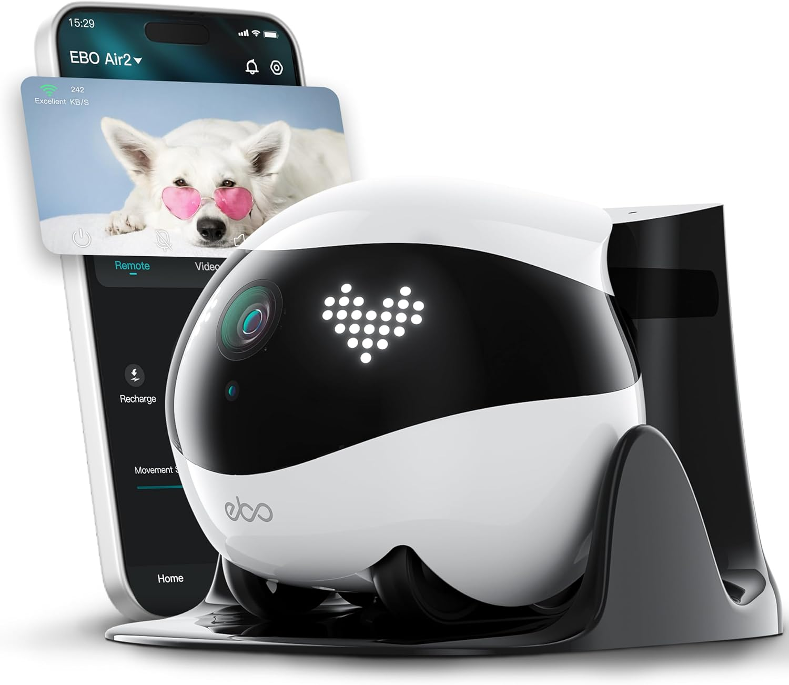
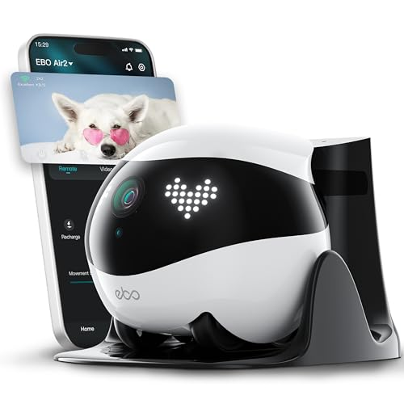
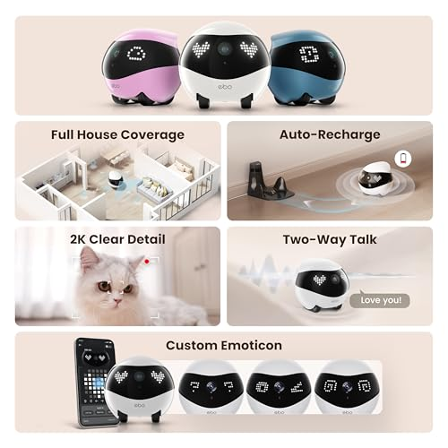
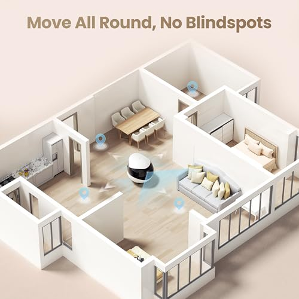
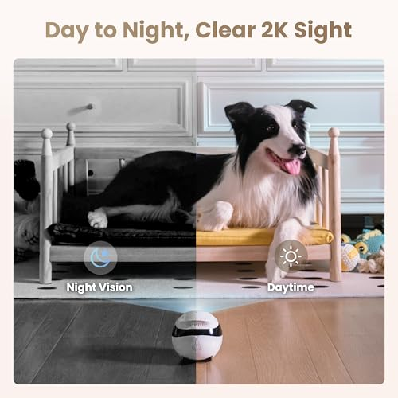
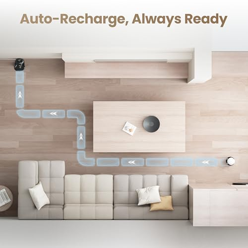
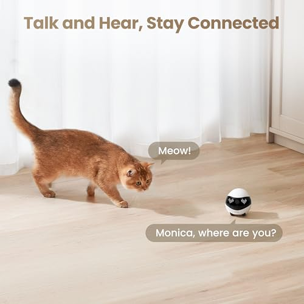

# Enabot EBO Air 2 FamilyBot,Pet Camera Robot,2K Home Robot,Movable Indoor Camera,Custom Facial Expression,Auto-Recharge,Battery-Operated,2-Way Talk,Night Vision,32GB Memory Card Inside (White)

**Price**: £199.00
**Product URL**: [Link to Amazon](https://amzn.to/3NIoOya)

## Images

## Description

Are you tired of constantly worrying about your furry friends when you're away from home? Do you want to keep an eye on their antics without invading their privacy? Look no further than the EBO Air 2 pet camera robot!

Equipped with a tracked wheel design, this little robot delivers smooth roaming to see every corner of your house. And with remote control via the EBO Home App, you can view your pets from anywhere at any time. The app is user-friendly and intuitive, making it easy for anyone to keep tabs on their furry friends.

But what really sets the EBO Air 2 apart is its crystal clear 2K camera with night vision. With infrared LEDs, this robot can see through even the darkest corners of your home, giving you a complete view of your pets no matter the time of day. And with high-definition imagery, you'll be able to capture every detail of their antics.

But that's not all - the EBO Air 2 also lets you customize its emoticons to match your mood. Whether you want a happy face or a wink, you can design your own robot to suit your needs. And with three fresh color options (White/Pink/Blue), you can blend tech seamlessly into your lifestyle.

With two-way talk and local storage, the EBO Air 2 pet camera robot is perfect for comforting anxious dogs or watching live as cats explore. And with a built-in speaker, you can communicate with your pets from anywhere in the world. Plus, with a 32GB microSD card included, every cherished moment is captured by this little robot.

And if the battery runs low, don't worry - the EBO Air 2 pet camera robot will navigate back to charge using infrared scanning. Just place the charging dock in an open area away from mirrors or glass for reliable returns.

In summary, the EBO Air 2 pet camera robot is an excellent investment for any pet owner who wants to keep an eye on their furry friends without invading their privacy. With its smooth roaming capabilities, clear 2K camera with night vision, customizable emoticons, two-way talk, local storage, and automatic recharging features, you won't be able to put this little robot down. So why wait? Invest in the EBO Air 2 pet camera robot today and experience peace of mind knowing your pets are safe and sound!

## Top Reviews

### 5.0 out of 5 stars - 5.0 out of 5 stars
**By Barry Perryman**

> Wow very impressive and image quality is amazing.
Simply when out and about you can keep an eye on your home.
This companion travels around the ground floor level and you can view on your mobile.
Record anything going on also voice control so any pets being naughty you can talk to them.
Or even security while out. Notifications with alerts.
The robot travels back to base to charge up automatically
Absolutely amazing and value for money
And very highly recommended

---
### 5.0 out of 5 stars - 5.0 out of 5 stars
**By Youdontownme**

> I love this! It's essentially a robot video camera that you can control remotely from an app. I use it to check in on my dogs when they're at home alone - I can direct it to whichever room I wish and I can deliver little messages to the dogs. It automatically recharges itself at its dock which is fantastic. I just love it!

---
### 1.0 out of 5 stars - 1.0 out of 5 stars
**By Mike**

> Absolute garbage. Won’t obey controls. Gets stuck on anything bigger than a couple of mm high. Don’t waste your money!!

---
### 4.0 out of 5 stars - 4.0 out of 5 stars
**By Nikkor**

> This is a review of "Air 2 Pet Camera Robot: 2K Home Robot, Movable Indoor Camera, Custom Facial Expression, Auto-Recharge, Battery-Operated, 2-Way Talk, Night Vision, 32GB Memory Card Inside (White)"

I will admit that this was ordered mostly out of curiosity as I hadn't never tried anything like it before.

I have a dog and, on the odd occasion when he is left home alone, I would often plug in a static IP camera to keep an eye on him. These sort of cameras are now cheap, widely available, and enable two-way communication.

This device really only differs from the cheaper cameras due to its mobility (that and the gimmicky facial impressions I suppose). Okay so it has the automatic recharge functionality, which is handy.

It's definitely a lot of fun to use, the app works very well, and it does everything that it is supposed to do, very well. But it's nearly 200 quid! (at time of review anyway).

So you need to ask yourself if that mobility aspect is important enough to you to justify that outlay. You could buy several small IP cameras to cover different rooms and still have plenty of change from 200 quid...

Note: As a member of the Vine program I was supplied with this item free of charge. I will always provide an impartial and fair review of the product in question. My rating system is as follows:

5 Stars – an exceptionally good, high quality product with no perceived shortcomings
4 stars – a very good product that met my expectations
3 stars – a product which could be better in some respects, but is still fit for purpose
2 stars - a product with significant shortcomings, one which disappointed
1 star - an absolute disaster of a product that should not be on sale

---
### 3.0 out of 5 stars - 3.0 out of 5 stars
**By Princesa**

> So I got this delivered this week and I’m checking how it all works as there is a 30 days return period. I like the idea and that I can check my cat if I’m away from home. The robot goes well to charging station, however you need to drive it next to the charging station so it doesn’t get lost… otherwise the battery drains and that will be the end of your camera view until you return home. I tried to see if the 4-7h promised holding the charge is actually true without being plug to the dock, it drained so quickly not sure if the battery needs to be active for a while before it charges fully. For eg. I got it out the dock, put to sleep and in less that 1h it went down from 100% charge to 87% this was on sleep mode without any activity, how can it drain without activity…. I guess it has something to do with the WiFi connection being active? Not sure. But testing will continue, do I have a faulty battery or is this how it should work that is TBC. Camera quality is ok, can’t compare to prior versions as I didn’t have one, you need to step back if you need a wider view. Stability seems ok and can manage when moved around objects and goes back to working position, however if you have the door threshold carpet/laminated cover in the floor then you might have a problem, the robot will get to the room and cannot get out of the height is over 0.5cm, this is no ideal but I can see why they did this, perhaps to improve stability and being able to manage to return to position if it goes side wise. This is not ideal as two rooms have the thresholds and once it was in it was stuck in the room. Sounds are ok but depends on your pet, I used them to grab attention when activating the robot and seems to work for my cat. Haven’t checked yet the speaker with someone to see how it delivers need to get someone on the other side while I speak so this needs testing. Regarding the driving with the application it can be difficult sometimes but I guess you need to practise, I notice one finger as a joystick rather than the arrows works better. This is the review so far but will monitor for another week or two. If the battery keeps draining it will probably go back but we shall see. At this price tag, it’s not ideal that the battery doesn’t hold as much charge as expected. Yesterday for example it was driven for 1h in total and it die out, couldn’t return to dock nor was I able to check on my car after it die so you need to be very mindful of constantly checking the battery status. My cat unlike other reviews actually likes this gadget and the laser to play with, he is not scare of hoovers or cleaning robots so I guess the noise of this robot doesn’t bother him either but I can see how it can make other pets not liking it, it’s not excessivly noise but it makes quite of a noise. I’m giving a 3 stars rating for the disappointment of the battery but will come back in a couple of weeks and confirm if it was a battery issue or something else. Just to add, connection to WiFi went ok, you need to remember to switch off again after pairing with your phone (which I didn’t to start with) as otherwise it will not connect.

---
