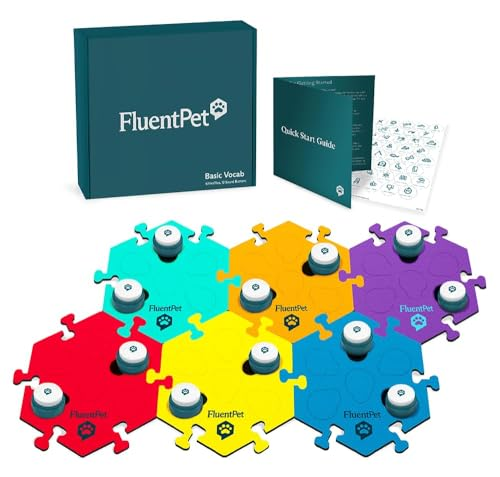
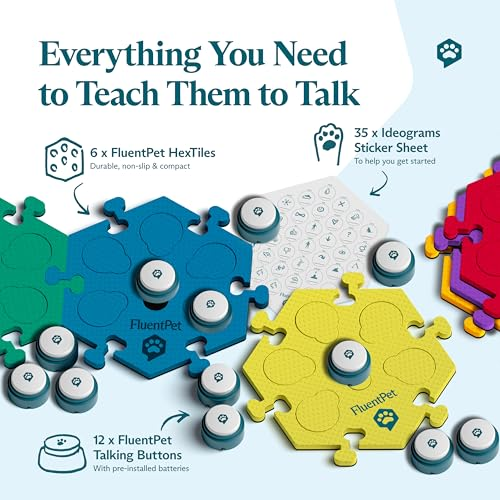
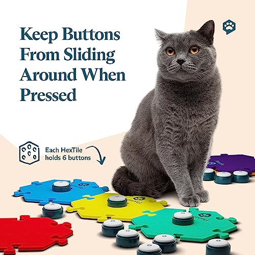
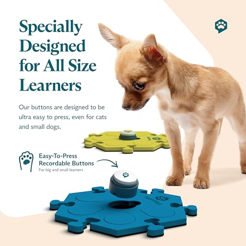
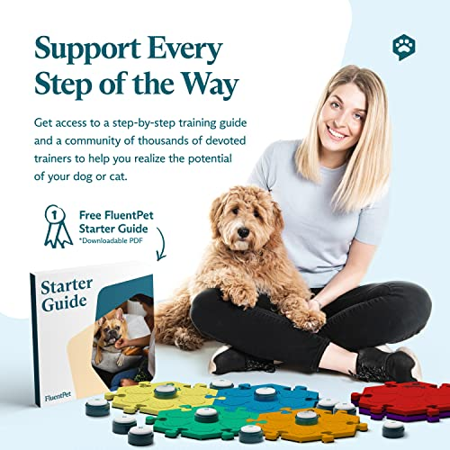
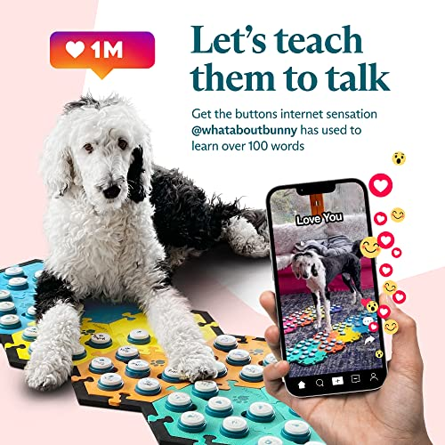

# FluentPet Basic Vocab Kit - Set of 12 Talking Buttons with Batteries Included for Dogs & Cats and 6 HexTiles - Customizable Cat & Dog Training Buttons for Communication - Talking Button Gift Set

**Price**: £202.98
**Product URL**: [Link to Amazon](https://amzn.to/3OaiGPd)

## Images

## Description

Are you tired of trying to guess what your furry friend is thinking or feeling? Well, with the FluentPet Speak Up! Get Started Kit, you can finally teach your dog or cat to express themselves in a way that's easy to understand. This comprehensive set includes everything you need to get started, including 12 premium recordable buttons, 6 HexTile mats, and 35 customizable stickers.

One of the key features of this kit is its ability to help "fluent pets" learn faster and build a richer vocabulary. With the FluentPet Speak Up! Get Started Kit, you can record the exact words or phrases you want your dog to learn and arrange them on the patented HexTile mats by category, making it easy for dogs and cats to associate words with actions. And if you need a little help getting started, there's a helpful step-by-step video included in the product listing that will guide you through the setup process quickly and easily.

Another great feature of this kit is its compact size, which makes it perfect for small dogs and cats of all ages. Each button requires just 0.5 lbs of pressure to activate, making it easy for paws of all shapes and sizes to use. And because each patented HexTile holds up to 6 talking buttons snugly in place, you can easily add more buttons as your dog's vocabulary grows.

But the FluentPet Speak Up! Get Started Kit doesn't stop there. It also comes with access to easy-to-follow teaching resources and a global community of trainers and dog owners. This means that you can connect with others who are using this kit to teach their own dogs and cats, share tips and tricks, and get inspired by real-life success stories.

Overall, the FluentPet Speak Up! Get Started Kit is an excellent choice for anyone looking to improve communication with their furry friend. With its easy-to-use buttons and mats, customizable stickers, and access to helpful resources and a supportive community, this kit has everything you need to get started on the journey to a more fluent pet.

## Top Reviews

### 5.0 out of 5 stars - 5.0 out of 5 stars
**By Rimantas B.**

> Fantastic product which we use to button train our sphynx cat, they have been able to learn how to ask for treats and to say loving things to us. It’s a bit hard to get your cat to use these at first but when you persistently try it eventually works out!

---
### 4.0 out of 5 stars - 4.0 out of 5 stars
**By JG**

> Bought them for my daughter to try with her dogs. Easy to use and set up. Dogs love the 'treat' button

---
### 4.0 out of 5 stars - 4.0 out of 5 stars
**By 001**

> I order this tester kit of 2 buttons as I wasn`t sure if our Labrador would be focused enough to use them.
He pleasantly surprised me although 1 button we recorded "treat" & yes like a true Labrador he persistently pressed that button.
It`s a shame however that despite searching the internet it appears that I am unable to purchase supplementary buttons. The only way I have found is to pay huge P&P from the USA.
If I had realised this in the start, despite loving the FluentPet brand, I would have chosen a different brand that is readily available in the UK & doesn`t require being imported at an inflated cost to the customer
A set of 12 was discounted to
PURCHASE £91 from £114
SHIPPING £44
TAXES £27 Totalling £71 (buttons £91)

---
### 5.0 out of 5 stars - Talking Buttons are a Game-Changer
**By VLW**

> I wish these had been invented decades ago--I wonder what my other wonderful dogs might have said to me. The product is good quality and there is ample customer support. I had one button go flat (out of several packages of these I've purchased) and the seller promptly sent me several new batteries for it, free of charge. My boy races for his buttons first thing every morning and starts communicating. It's a lot of fun for both of us. And it can be eye-opening at times: I had been working at the computer for a while when I suddenly heard "Mom. All done. Play." Need I say more?

---
### 5.0 out of 5 stars - Works great
**By Charlotte**

> Exactly as advertised, but buttons are smaller than anticipated. Not sure why some people had issues with the sound. Mine works great - I made sure to speak loud/ clear when recording, and there are no issues with the playback volume. Sound comes from the top of the button and is clear. Buttons stay tightly in the mat, and the mat doesn’t slide around easily. Will have to see how long they last, but no issues so far!

---
