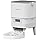
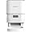
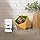
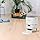
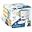

# Groov-e Pet-Tech Automatic Pet Feeder – Cat and Small Dog Dry Food Dispenser, 4L Capacity, Up to 6 Meals a Day, Airtight Lid, LED Display – Battery or Mains Powered – White

**Price**: £49.49
**Product URL**: [Link to Amazon](https://amzn.to/4k34mnI)

## Images

## Description

As a pet owner, you always want to ensure that your furry friend is well fed and taken care of. However, with busy schedules and other responsibilities, it can be challenging to maintain a consistent feeding routine. That's where the Groov-e Pet-Tech automatic pet feeder comes in handy. This innovative device has been designed specifically for dry food and can hold up to 4L, reducing the need for constant refills.

One of the most significant benefits of this product is its ability to schedule meals up to six times a day with flexible portion sizes. This feature allows you to manage your pet's routine effectively, control portions, and avoid missed meals even on busy days. With the Groov-e Pet-Tech automatic pet feeder, you can rest assured that your cat or small dog is always getting the right amount of food at the right time.

The airtight, lockable lid of this device keeps food dry, crisp, and protected, preventing pets from sneaking extra portions between feeds. This feature ensures that your pet is consuming only the recommended amount of food, helping to maintain a healthy weight and prevent other health issues associated with overfeeding.

Another great feature of this product is its dual power options. The device works with the included mains adaptor or 4x AA batteries (not included), allowing feeding to continue reliably even during power cuts. This means that you won't have to worry about your pet going without food, even in case of a power outage.

The removable food tray and clear LED display make cleaning and scheduling easy. The removable food tray allows for easy cleanup, while the clear LED display makes it easy to schedule meals and monitor the amount of food remaining. This feature ensures that feeding routines are simple and hassle-free.

In conclusion, the Groov-e Pet-Tech automatic pet feeder is an excellent choice for pet owners who want to ensure that their furry friend is well fed and taken care of. With its ability to schedule meals up to six times a day with flexible portion sizes, it helps manage your pet's routine effectively. The airtight, lockable lid keeps food dry, crisp, and protected, while the dual power options ensure that feeding can continue reliably even during power cuts. Overall, this product is designed for convenience and ease of use, making it an excellent investment for any pet owner.

## Top Reviews

### 5.0 out of 5 stars - 5.0 out of 5 stars
**By Emma Ashfield**

> Well l got this because my dog wasn't drinking much but this works great but down side of it all it has to be plug in all the time

---
### 4.0 out of 5 stars - 4.0 out of 5 stars
**By book mad**

> I didn't want one that needed to be plugged in and did not want anything too hi-tech.
This is relatively easy to set up, and set the meal schedule.
We have already tried it out.
We did find it easier to do a factory reset than alter the schedule though.

---
