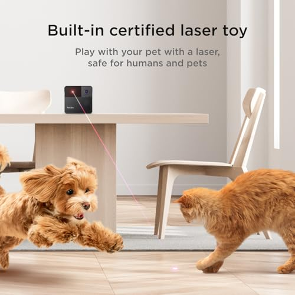
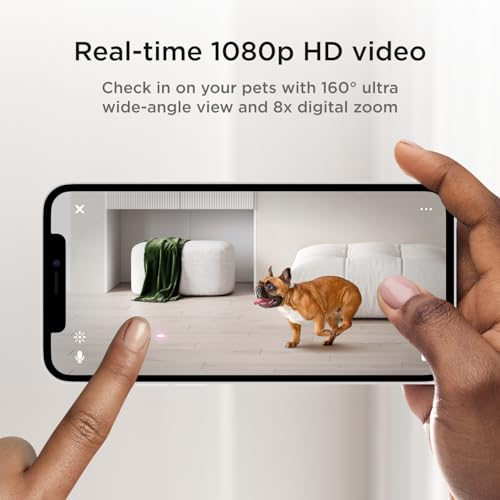

# Petcube Play 2 | Wi-Fi Pet Camera with Laser Toy for Cats & Dogs. 1080P HD Video, 160° Full-Room View, 2-Way Audio, Sound/Motion Alerts, Night Vision, Pet Monitoring App

**Price**: £87.99
**Product URL**: [Link to Amazon](https://amzn.to/3MbpFa3)

## Images

## Description

The Petcube Play 2 is an excellent smart pet camera that offers a range of features designed to keep your furry friend entertained and secure while you're away from home. The high-quality, 1080p HD video, 160° wide-angle lens, and night vision capabilities provide clear day/night monitoring that you can access from anywhere in the world through a compatible smartphone or tablet.

One of the most appealing aspects of this camera is its interactive laser toy, which allows for remote play with both manual and auto-play modes. This feature is particularly well-suited for cats who love to chase and pounce on moving objects, making it an excellent tool to keep your feline friend entertained while you're away from home.

The Petcube Play 2 also features two-way audio, allowing you to hear and talk to your pet as if they were right in the room with you. While some users have noted that the sound quality could be improved, overall it's a great way to keep in touch with your furry companion and ensure they're doing well.

In addition to its impressive camera features, the Petcube Play 2 also integrates with Amazon Alexa, allowing you to control the camera using voice commands. This makes it easy to monitor your pet from anywhere in your home without having to manually navigate through menus on your smartphone or tablet.

The camera also supports both 2.4GHz and 5GHz Wi-Fi, which improves connection stability over previous models. However, keep in mind that you'll need a paid subscription (Petcube Care) to access advanced features like video history and smart alerts. While this may add an extra layer of convenience and peace of mind, it does make the camera relatively expensive.

Overall, the Petcube Play 2 is a well-built, easy-to-use choice for pet owners looking for a remote monitoring solution. While it's not perfect and requires a subscription to access all its features, it's an excellent tool for keeping your furry friend entertained and secure while you're away from home.

## Top Reviews

### 1.0 out of 5 stars - 1.0 out of 5 stars
**By Dean**

> Do not use these with dogs, especially gun dogs or working breeds. Using lights or lasers to occupy a dog causes canine compulsion disorder and will make them relentlessly chase shadows on lights all the time. You have been warned.

---
### 2.0 out of 5 stars - I recommend buying the camera, but I do not recommend paying even a penny for additional services.
**By Stanislav Hlushak**

> With its good design and relatively low price, this product is not fully developed. After 15 years on the market, they could have already refined the product and set reasonable prices, rather than following our Ukrainian style (the fewer orders, the higher the price for additional services; we have to earn what we want, and that's how it works for you).

So, the pros:
1. The price of the product is NOT high.
2. Good design.
3. Easy to install.
4. Excellent image quality.

Cons:

1. The camera cannot be connected to an external speaker and data storage device
2. The camera cannot be connected to the internet via a cable (as everyone knows, Wi-Fi routers slow down the internet)
3. When playing with the laser, the laser does not keep up with the controller and often shines in the wrong direction
4. When the image is zoomed in, other functions stop working, including the laser, speaker, and microphone, and nothing can be turned on or off.
5. The automatic laser game is terrible; the laser shines anywhere but the floor.
6. The camera works for exactly two hours, after which it apparently goes into sleep mode and the app shows it as offline. The camera does not return to working mode even with a paid subscription to additional services (all possible error options and connections to different Wi-Fi networks and modems have been checked — the problem is on your side).
7. The paid version connects easily, but the option to disable it is hidden, for which you can expect a class action lawsuit. This manipulation works in Ukraine but not in the US and EU. Here, it is considered user deception.
8. Paid services are a good idea, but they work terribly. All notifications are the same: ‘Your dog has appeared in the camera's field of view,’ but there are no promised notifications (iPhone 14 Pro with the latest firmware) on specific topics.
9. Notifications may arrive when the camera is turned off, several hours after it has been turned off.
10. Why does video recording turn on when the user just wants to look at their pet? You have buttons to turn on recording. Maybe I don't want to record. On the other hand, automatic recording is useful, but I haven't seen a single camera device that charges money for recording.

11. The price for additional services seems to have been pulled out of thin air. Professional services for marketers are cheaper, so why pay here? For poorly designed services? 5-7 roubles is still acceptable for this crap, but 20 or even 40 is unjustified greed.

In general, the conclusion is simple: the price of the camera corresponds to its quality, but the price and quality of additional services are terrible and scare people away from you.

I recommend buying the camera, but I do not recommend paying them even a penny for additional services.

---
