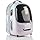
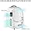
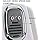
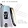
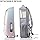

# PETKIT Cat Carrier Backpack with Inbuilt Fan & Light, Ventilated Cat Bubble Back Pack for Pet Dog with Padded and Adjustable Strap, Detachable and Lightweight for Travel Hiking Walking Camping

**Price**: £69.99
**Product URL**: [Link to Amazon](https://amzn.to/4bjXu2W)

## Images

## Description

If you're looking for a high-quality pet carrier that is both stylish and practical, PETKIT is the perfect choice. The backpack features breathable mesh panels and multiple ventilation holes, as well as the clever 2.0 Coanda Effect ventilation system, which ensures your furry friend stays comfortable on the go.

One of the key features of this carrier is its spacious appearance, with a generous window that allows your cat to enjoy the scenery while traveling in comfort. The tinted window also keeps out harsh light, making it a calming place for your cat to relax.

In terms of comfort, PETKIT's backpack is designed with extra thick padding on both the back and adjustable shoulder straps, which helps relieve the burden on your shoulders and back, making it more comfortable to wear. Additionally, the carrier's lightweight design makes it easy to carry around, even for longer trips.

Another great feature of this backpack is its eye-catching design, which is both stylish and functional. The backpack is also airline approved, meaning you can use it for travel without any hassle.

Overall, PETKIT's backpack is an excellent choice for anyone looking for a reliable and practical pet carrier that is also comfortable to wear. With its breathable mesh panels, multiple ventilation holes, and clever ventilation system, your cat will stay comfortable on the go, while the spacious appearance and eye-catching design make it an attractive choice for any furry friend.

## Top Reviews

### 5.0 out of 5 stars - 5.0 out of 5 stars
**By Oli**

> Very sturdy! I have 3 cats,one large and they all have lots of room in it. Looks great, it's very comfortable to wear it, there is a light and a fan inside the backpack. I am super happy with this purchase.

---
### 5.0 out of 5 stars - 5.0 out of 5 stars
**By James**

> Our cat was constantly getting her claws stuck in our other cat carrier, but we couldn't go for a full hard plastic case as it needs to go inside the car.
It has a hard shell, so she was protected and appeared at ease and comfortable inside during her travels.
Obviously there is no assembly required, so that part was easy.
It is a little heavier than the canvas bag we previously used, but you can use this as a backpack so makes it easier to carry.

---
### 4.0 out of 5 stars - 4.0 out of 5 stars
**By K.J**

> This product is brilliant! I needed a carrier for my Yorkshire Terrier for my moped & this is perfect. He didn’t make a fuss when I put him into it, he had plenty of room & it feels really secure! The product seems to be good quality & i’m happy to pay out more for safety reasons. I’m hoping it proves to be worth the money as time goes on.

---
### 5.0 out of 5 stars - 5.0 out of 5 stars
**By Ebru tITIZ**

> It works very well.

---
