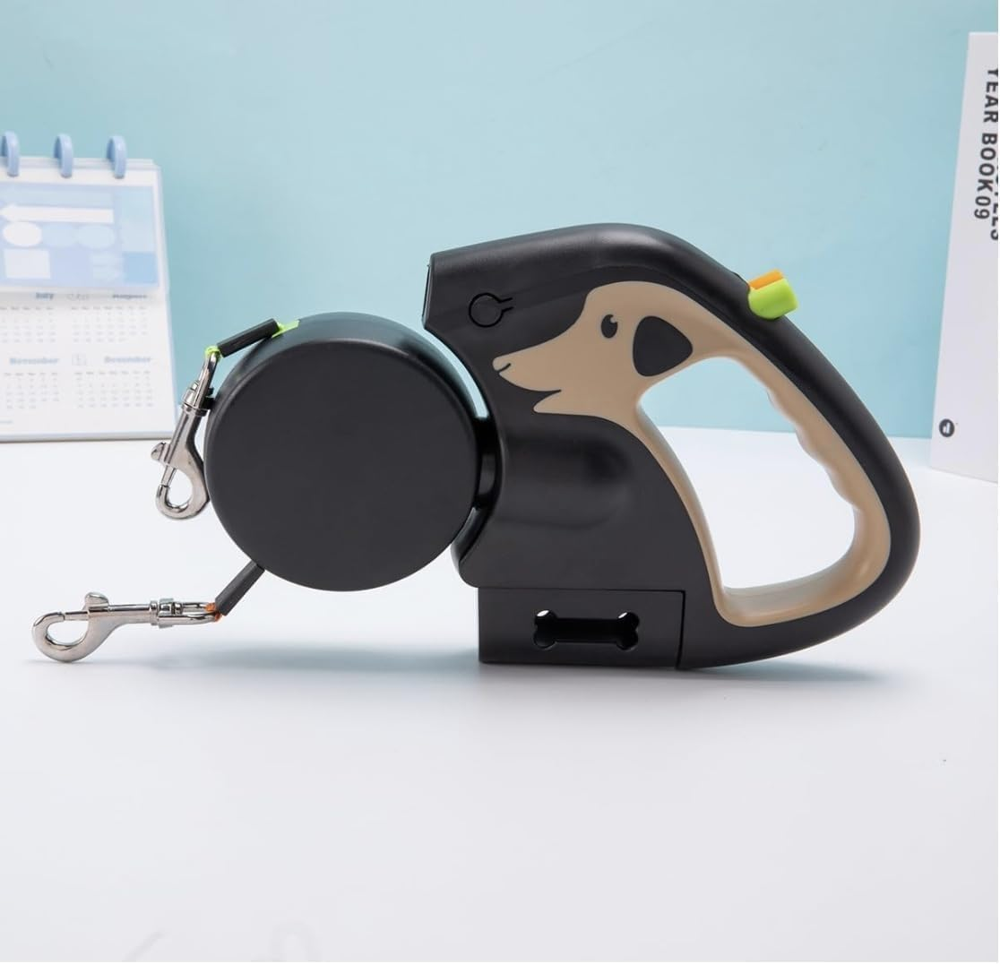
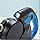
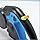
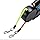
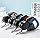
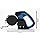
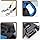

# Retractable Double Dog Leash for 2 Dogs with 360 degrees Swivel，No Tangle 360 Technology, LED Flashlight, Poop Bag Holder, Reflective Leads for Safety,Dual Locking(Brown)(Brown)

**Price**: £18.99
**Product URL**: [Link to Amazon](https://amzn.to/4qzZTeA)

## Images

## Description

If you're a dog owner looking for a reliable and convenient way to walk your furry companions together, this dual retractable pet leash is definitely worth considering. The product features a durable design that can withstand even the most demanding outdoor adventures. With its premium materials, which include ABS plastic, metal, and heavy-duty nylon, you can trust that this leash will last for years to come.

One of the most impressive things about this leash is its dual retractable rope system, which allows you to walk two dogs simultaneously with ease. This means that you can enjoy longer walks without worrying about getting tangled up or losing control. Additionally, each retractable rope extends up to 3 meters, providing ample freedom for your furry companions to explore.

The ergonomically designed handle is another standout feature of this leash. It's large enough to comfortably fit your hand and provides maximum comfort during extended walks. The handle measures 19cm x 20cm, so you won't have to worry about it slipping out of your hand while walking your dogs.

This leash is versatile enough to suit dogs of various sizes, from small to large breeds. However, it's important to note that the maximum weight for each dog should not exceed 50 lbs. Puppies tend to chew more than others, so please be careful not to let them chew through the webbing which will break for any leash brand sold globally.

Overall, if you're looking for a reliable and convenient way to walk your furry companions together, this dual retractable pet leash is definitely worth considering. With its durable design, premium materials, ergonomic handle, ample length, and versatile compatibility, it's sure to meet all of your needs.

## Top Reviews

### 5.0 out of 5 stars - 5.0 out of 5 stars
**By Sheena Penny**

> Excellent for taking 2 dogs out at same time without getting in a tangle and control the length each dog goes. The light is very handy in the dark mornings and also has a bit for storing rolls of poo bags.

---
### 1.0 out of 5 stars - 1.0 out of 5 stars
**By IOW4465**

> Lead was faulty and would not retract. Impossible to return ! No contact details that worked. Got a return label which has just been returned to us by the royal mail saying that address was incomplete. Used the printed one they issued!
We paid £5.40 postage to get the parcel delivered back to us!!
Do not use this Product

---
### 3.0 out of 5 stars - 3.0 out of 5 stars
**By howardsway**

> It’s ok, it doesn’t always keep them untwisted, but on the whole only fails once or twice, the buttons however are awful, they get stuck and you have to keep pressing to release. I have two chihuahuas, but still I worry slightly that the cords will break after reading some reviews. However this one was cheaper than the same ones being sold for double so figured if it breaks it’s only a tenner. Time will tell I guess

---
### 5.0 out of 5 stars - 5.0 out of 5 stars
**By K. C. Gordon**

> Excellent lead does not tangle
Why did you choose this product over others?:
because it was a sensible price

---
### 1.0 out of 5 stars - 1.0 out of 5 stars
**By Elizabeth G.**

> Awful. Do not buy. Doesn’t retract properly or keep the dogs from getting tangled up! Want a refund but am expected to pay postage for a faulty item! Rip off!

---
