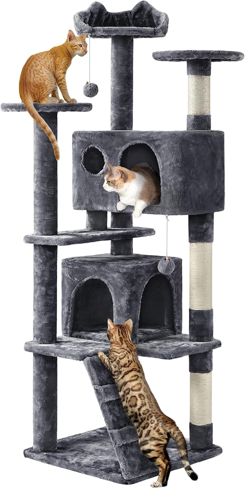
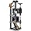
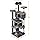
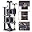
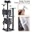

# Yaheetech Cat Tree, 158cm Cat Tower with Scratching Post, 2 House and Dangling Balls Cat Furniture for Indoor Cats Kittens, Dark Grey

**Price**: £37.99
**Product URL**: [Link to Amazon](https://amzn.to/4pZ74Ms)

## Images

## Description

If you have a feline friend in need of a new place to play, sleep, and rest, then look no further than this multi-level cat house. This plush cat tree is an excellent choice for cats of all ages, providing them with plenty of interesting layouts to satisfy their needs.

One of the most impressive features of this cat tower is its versatility. With three perches, two round platforms, and a cat-ear-shaped edge, there's no shortage of places for your cat to relax and rest. Additionally, the ladder, two condos with doors, and several scratchers provide plenty of opportunities for play and exercise.

Another great aspect of this cat tower is its stable and safe design. With double security features, including an anti-toppling strap attached to the middle board that can be anchored to the wall, you can rest easy knowing that your feline friend will be safe while using this cat stand.

The materials used in the construction of this cat tower are also top-notch. Made from CARB P2-compliant manufactured wood, covered by soft plush, and connected by metal accessories, you can be sure that your cat will enjoy a comfortable and safe environment.

Overall, if you're looking for a high-quality, versatile, and stable cat tower that will provide your feline friend with plenty of places to play, rest, and scratch, then this multi-level cat house is the perfect choice.

## Top Reviews

### 5.0 out of 5 stars - 5.0 out of 5 stars
**By Ms. Julija Umbrasa**

> Bought this tree for our wee kitten. He absolutely loves it! It was fairly easy to put together, and it is very sturdy. It has a special strap for attaching it to a wall, but to be honest, there is no need really. It is very stable and heavy enough. Our kitten is using scratching posts all the time and likes to sleep at the top of the tree. The cover of the tree is like a soft fur. As for the cleaning, just hoover it once a week and job done. Its size and configuration provides a full playing station for a cat. Certainly a good Cat Tree. Me and my kitten are very happy.

---
### 5.0 out of 5 stars - 5.0 out of 5 stars
**By A. Pickering**

> Bigger than expected. Instructions were good and the pieces were labelled. It looks fantastic. Excellent quality and the price way lower than similar items at the pet shop.

---
### 4.0 out of 5 stars - 4.0 out of 5 stars
**By Cath**

> My kittens are 6 months old and were showing signs of getting bored with some of their toys. Still too young to let out, this cat tree tower seemed like a good choice to keep them amused. . Assembly took a while mainly as the kittens loved jumping on the parts and swiping the bolts. One concern is that I received the exact number of bolts needed with no spares. A good job the kittens didn’t manage to hit and hide any!
My kittens seem to like it although mostly as a new place to play fight! Decent value and it seems pretty good quality too. Very happy with this purchase and my living room has a new piece of furniture. Yes, it’s quite big!

EDITED: 2 months in and after being jumped on A LOT by my energetic kittens, the tall platform has collapsed. The plastic thread just couldn’t take the feline pressure and after a month of wobbles, toppled today! I’ve moved the short platform from the top down so let’s see how long it lasts! One star removed as 2 months is not that long…

---
### 5.0 out of 5 stars - 5.0 out of 5 stars
**By Christine Fields**

> Bought for our 2 kittens, they both love it, climbing it, sleeping on it, and playing. Easy to build and appears solid. Did use wall attachment as it wobbles a bit when they fly up it but does appear stable. Looks great and not too big (158cm)

---
