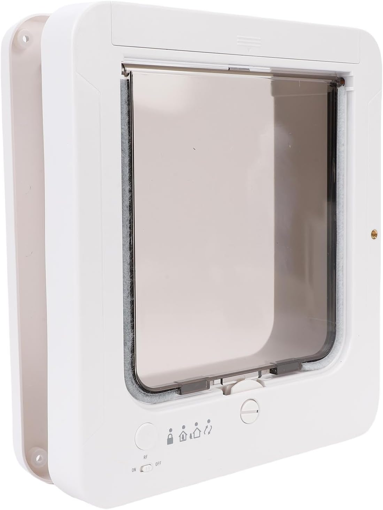
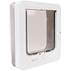
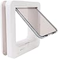
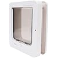
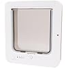
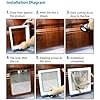
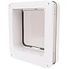

# Zerodis Cat Doors Entry and Exit Options Cat Door Automatic Dog Smart Sensing Technology Electronic Flap Collar Activated Pet Access Smart Pet Dual

**Price**: £91.86
**Product URL**: [Link to Amazon](https://amzn.to/3LyQzbR)

## Images

## Description

The Smart Cat Door is a fantastic product that has revolutionized pet management in our household. One of the most impressive features of this door is its safety guard mechanisms which provide peace of mind knowing that my pets are always secure when they enter or exit the house. The collar-activated design also makes it incredibly easy to let my pets in and out, saving me time and effort.

Another great feature is the dual entry and exit options, which give my cats the freedom they need to move around as they please. This design also ensures that no unwanted animals enter our home through the door. The Smart Cat Door is built with high-grade plastic materials that are easy to clean and can withstand daily use, making it a practical addition to any household.

One of the most impressive aspects of this product is its advanced sensing technology which automatically identifies my pets' identity and manages their entry and exit direction. This feature ensures seamless navigation for my furry friends and eliminates the need for manual intervention when they enter or exit the house.

Overall, I highly recommend the Smart Cat Door to anyone looking for an easy-to-use, reliable, and secure pet management solution. It has made a significant difference in our household and has given us peace of mind knowing that our pets are always safe and secure.
